# Polyglot Codebase Knowledge Graph

> Generated offline by **readmenator**. Supports C, C++, Python, Go, Rust, JS/TS, Java, C#, Shell, PHP, Dart, GDScript, Nim, ASM, Ruby, Swift, Kotlin, Scala, Lua, Elixir.
> No LLMs. No tokens. Pure static analysis. See more [here](https://github.com/grisuno/ReadMenator)

**Total Files Parsed:** 7 | **Total Symbols Extracted:** 65 | **Total Imports:** 43
 | **Resolved Imports:** 8

<!-- ranking_model: v1.0 | weights: {ppr:0.45,auth:0.2,test:0.15,doc:0.1,fresh:0.1} | alpha:0.85 | commit:f0ae16d | date:2026-07-18 -->


## Table of Contents

1. [Statistics Dashboard](#statistics-dashboard)
2. [Architectural Layers](#architectural-layers)
3. [Ranked Context](#ranked-context)
4. [God Nodes](#god-nodes)
5. [Community Analysis](#community-analysis)
6. [Suggested Questions](#suggested-questions)
7. [Hotspot Analysis](#hotspot-analysis)
8. [Change Impact Analysis](#change-impact-analysis)
9. [Suggested Linting Rules](#suggested-linting-rules)
10. [Orphans](#orphans)
11. [Query Recipes](#query-recipes)
12. [Structural Knowledge Map](#structural-knowledge-map)
13. [UML Class Diagram](#uml-class-diagram)
14. [Code Property Graph](#code-property-graph)
15. [Architecture Reference](#architecture-reference)
    - [PY (6 files)](#py-6-files)
    - [SH (1 files)](#sh-1-files)

---

## Statistics Dashboard

| Metric | Value |
|--------|-------|
| Total Files | 7 |
| Total Symbols | 65 |
| Total Imports | 43 |
| Call Edges | 727 |
| Inheritance Edges | 9 |
| Languages | 2 |
| Avg Symbols/File | 9.3 |
| Avg Imports/File | 6.1 |
| Resolved Imports | 8 |

### Top Files by Import Count (Fan-Out)

| File | Imports | Symbols | Language |
|------|---------|---------|----------|
| `super_casette.py` | 9 | 15 | py |
| `voz.py` | 9 | 12 | py |
| `agi.py` | 8 | 25 | py |
| `app.py` | 7 | 6 | py |
| `uni.py` | 5 | 2 | py |
| `unificado.py` | 5 | 5 | py |

---

## Architectural Layers

Auto-detected from path patterns, naming conventions, and imported frameworks.

| Layer | Files |
|-------|-------|
| utility | 7 |

### utility

- `agi.py` (py, 25 symbols)
- `app.py` (py, 6 symbols)
- `install.sh` (sh, 0 symbols)
- `super_casette.py` (py, 15 symbols)
- `uni.py` (py, 2 symbols)
- `unificado.py` (py, 5 symbols)
- `voz.py` (py, 12 symbols)

---

## Ranked Context

Files ranked by composite score for the current query context. The ranking combines Personalized PageRank (query relevance), global authority, test coverage, documentation coverage, and code freshness. Model: v1.0.

| Rank | File | Composite | PPR | Authority | Test | Doc |
|------|------|-----------|-----|-----------|------|-----|
| 1 | `agi.py` | 0.3115 | 0.4668 | 0.4668 | 0.00 | 0.08 |
| 2 | `voz.py` | 0.1676 | 0.0911 | 0.0911 | 0.00 | 1.08 |
| 3 | `app.py` | 0.1426 | 0.0911 | 0.0911 | 0.00 | 0.83 |
| 4 | `unificado.py` | 0.1296 | 0.1686 | 0.1686 | 0.00 | 0.20 |
| 5 | `uni.py` | 0.1092 | 0.0911 | 0.0911 | 0.00 | 0.50 |
| 6 | `super_casette.py` | 0.0792 | 0.0911 | 0.0911 | 0.00 | 0.20 |
| 7 | `install.sh` | 0.0000 | 0.0000 | 0.0000 | 0.00 | 0.00 |

---

## God Nodes

Most architecturally central files ranked by combined import/export degree and symbol richness.

| File | Score | Connections | PageRank |
|------|-------|-------------|----------|
| `agi.py` | 12.5 | | 0.4668 |
| `unificado.py` | 6.5 | | 0.1686 |
| `voz.py` | 5.2 | | 0.0911 |
| `uni.py` | 4.2 | | 0.0911 |
| `super_casette.py` | 3.5 | | 0.0911 |
| `app.py` | 2.6 | | 0.0911 |
| `install.sh` | 0.0 | | 0.0000 |

---

## Community Analysis

Files grouped by import-based community detection. Cohesion measures how tightly connected each community is internally.

### root (Cohesion: 1.00)

**6 files** in this community:

- `agi.py` (py, 25 symbols)
- `app.py` (py, 6 symbols)
- `super_casette.py` (py, 15 symbols)
- `uni.py` (py, 2 symbols)
- `unificado.py` (py, 5 symbols)
- `voz.py` (py, 12 symbols)

---

## Suggested Questions

Auto-generated exploration prompts based on graph structure:

- What does agi.py depend on, and what depends on it? (5 connections)
- What does unificado.py depend on, and what depends on it? (3 connections)
- What does voz.py depend on, and what depends on it? (2 connections)
- How are the 6 files in 'root' related to each other?
- What is ParityCassette in agi.py and how is it used?

---

## Hotspot Analysis

Files ranked by combined complexity (symbol count) and centrality (connection count). High-scoring files are architecturally critical and may need refactoring attention.

| File | Complexity | Centrality | Combined | Symbols | Connections |
|------|-----------|------------|----------|---------|-------------|
| `agi.py` | 1.000 | 1.000 | 1.000 | 25 | 14 |
| `voz.py` | 0.480 | 0.786 | 0.663 | 12 | 11 |
| `app.py` | 0.240 | 0.643 | 0.482 | 6 | 9 |
| `unificado.py` | 0.200 | 0.571 | 0.423 | 5 | 8 |
| `uni.py` | 0.080 | 0.500 | 0.332 | 2 | 7 |
| `super_casette.py` | 0.600 | 0.714 | 0.669 | 15 | 10 |
| `install.sh` | 0.000 | 0.000 | 0.000 | 0 | 0 |

---

## Change Impact Analysis

Files sorted by how many other files would be affected if they changed. High-impact files should be changed with caution.

| File | Direct Dependents | Transitive Dependents | Total Impact |
|------|------------------|----------------------|--------------|
| `agi.py` | 5 | 0 | 5 |
| `unificado.py` | 2 | 0 | 2 |
| `app.py` | 0 | 0 | 0 |
| `install.sh` | 0 | 0 | 0 |
| `super_casette.py` | 0 | 0 | 0 |
| `uni.py` | 0 | 0 | 0 |
| `voz.py` | 0 | 0 | 0 |

---

## Suggested Linting Rules

Automatically suggested linting and security rules based on patterns detected in the codebase. These can be exported as Semgrep rules using the `--export-rules` flag.

| Rule ID | Severity | Description | Language | Matches |
|---------|----------|-------------|----------|---------|
| `RM001` | info | Large number of functions in py: 53 total | py | 53 |
| `RM002` | info | Print statement found (consider logging instead) | python | 130 |

---

## Orphans

Files with no documentation or low connectivity. These are candidates for documentation investment or cleanup.

- `install.sh` (0 symbols, no doc)

---

## Query Recipes

Example queries you can run against this knowledge base using the ranking engine:

```
# Find files most relevant to a concept
readmenator query "Where is the import resolver implemented?"

# Rank files by relevance to a topic
readmenator query "How does documentation generation work?"

# Explain why a file ranks highly
readmenator query "explain readmenator/_documentation.py"

# Trace dependency paths with ranked context
readmenator query "path from CLI to exporter"
```

The ranking model uses the following signals:

- **Personalized PageRank** (45% weight): query-specific relevance via seed propagation
- **Global Authority** (20% weight): structural importance via standard PageRank
- **Test Coverage** (15% weight): fraction of symbols referenced in test files
- **Doc Coverage** (10% weight): presence of docstrings and file-level docs
- **Freshness** (10% weight): recent modification activity

Results include score decomposition and justification paths for each ranked item.

---

## Structural Knowledge Map

```mermaid
graph TD
    classDef mod fill:#1e1e1e,stroke:#ff6666,stroke-width:2px,color:#fff;
    classDef cls fill:#2d2d2d,stroke:#4ec9b0,stroke-width:2px,color:#fff;
    classDef fn fill:#333,stroke:#dcdcaa,stroke-width:1px,color:#dcdcaa;
    classDef ext fill:#111,stroke:#666,stroke-dasharray:5 5,color:#aaa;
    subgraph community_0 ["root"]
    voz_py["voz.py (py)"]
    class voz_py mod;
    voz_py_AGIVoiceLayer["AGIVoiceLayer"]
    class voz_py_AGIVoiceLayer cls;
    voz_py --> voz_py_AGIVoiceLayer
    voz_py_demo_voice_layer["demo_voice_layer"]
    class voz_py_demo_voice_layer fn;
    voz_py --> voz_py_demo_voice_layer
    voz_py___init__["__init__"]
    class voz_py___init__ fn;
    voz_py --> voz_py___init__
    voz_py__extract_binary_number["_extract_binary_number"]
    class voz_py__extract_binary_number fn;
    voz_py --> voz_py__extract_binary_number
    voz_py__extract_k_value["_extract_k_value"]
    class voz_py__extract_k_value fn;
    voz_py --> voz_py__extract_k_value
    super_casette_py["super_casette.py (py)"]
    class super_casette_py mod;
    app_py["app.py (py)"]
    class app_py mod;
    agi_py["agi.py (py)"]
    class agi_py mod;
    uni_py["uni.py (py)"]
    class uni_py mod;
    unificado_py["unificado.py (py)"]
    class unificado_py mod;
    install_sh["install.sh (sh)"]
    class install_sh mod;
    end
    app_py -- resolved_imports --> agi_py
    app_py -- resolved_imports --> agi_py
    super_casette_py -- resolved_imports --> agi_py
    uni_py -- resolved_imports --> unificado_py
    uni_py -- resolved_imports --> agi_py
    unificado_py -- resolved_imports --> agi_py
    voz_py -- resolved_imports --> agi_py
    voz_py -- resolved_imports --> unificado_py
    ext___future__["__future__"]
    class ext___future__ ext;
    agi_py -.->|imports| ext___future__
    ext_os["os"]
    class ext_os ext;
    agi_py -.->|imports| ext_os
    ext_torch["torch"]
    class ext_torch ext;
    agi_py -.->|imports| ext_torch
    ext_torch_nn["torch.nn"]
    class ext_torch_nn ext;
    agi_py -.->|imports| ext_torch_nn
    ext_torch_nn_functional["torch.nn.functional"]
    class ext_torch_nn_functional ext;
    agi_py -.->|imports| ext_torch_nn_functional
    ext_numpy["numpy"]
    class ext_numpy ext;
    agi_py -.->|imports| ext_numpy
    ext_typing["typing"]
    class ext_typing ext;
    agi_py -.->|imports| ext_typing
    ext_pathlib["pathlib"]
    class ext_pathlib ext;
    agi_py -.->|imports| ext_pathlib
    app_py -.->|imports| ext_torch
    app_py -.->|imports| ext_torch_nn_functional
    app_py -.->|imports| ext_numpy
    ext_agi["agi"]
    class ext_agi ext;
    app_py -.->|imports| ext_agi
    ext_sys["sys"]
    class ext_sys ext;
    app_py -.->|imports| ext_sys
    app_py -.->|imports| ext_pathlib
    app_py -.->|imports| ext_agi
    super_casette_py -.->|imports| ext_os
    super_casette_py -.->|imports| ext_sys
    super_casette_py -.->|imports| ext_torch
    super_casette_py -.->|imports| ext_torch_nn
    super_casette_py -.->|imports| ext_torch_nn_functional
    ext_math["math"]
    class ext_math ext;
    super_casette_py -.->|imports| ext_math
    super_casette_py -.->|imports| ext_pathlib
    ext_copy["copy"]
    class ext_copy ext;
    super_casette_py -.->|imports| ext_copy
    super_casette_py -.->|imports| ext_agi
    uni_py -.->|imports| ext_torch_nn_functional
    uni_py -.->|imports| ext_torch
    ext_time["time"]
    class ext_time ext;
    uni_py -.->|imports| ext_time
    ext_unificado["unificado"]
    class ext_unificado ext;
    uni_py -.->|imports| ext_unificado
    uni_py -.->|imports| ext_agi
    unificado_py -.->|imports| ext_torch
    unificado_py -.->|imports| ext_torch_nn
    unificado_py -.->|imports| ext_pathlib
    unificado_py -.->|imports| ext_typing
    unificado_py -.->|imports| ext_agi
    voz_py -.->|imports| ext_torch
    ext_json["json"]
    class ext_json ext;
    voz_py -.->|imports| ext_json
    voz_py -.->|imports| ext_time
    ext_ollama["ollama"]
    class ext_ollama ext;
    voz_py -.->|imports| ext_ollama
    ext_re["re"]
    class ext_re ext;
    voz_py -.->|imports| ext_re
    voz_py -.->|imports| ext_typing
    voz_py -.->|imports| ext_agi
    voz_py -.->|imports| ext_unificado
    voz_py -.->|imports| ext_sys
```



---

## UML Class Diagram

Auto-generated Mermaid class diagram from parsed class-level symbols. Shows classes, structs, interfaces, traits, and their methods with inheritance and dependency relationships.

```mermaid
classDiagram
  class agi_py_ParityCassette {
    <<class>>
    +get_parity_dataset(n_bits, k, size)
    +generate_wave_data(N, T, c, dt, L, seed)
    +generate_kepler_data(num_samples, seed)
    +generate_and_save_chaotic_pendulum_dataset(n_samples, seed)
    +demo_grokkit()
    +step(u_t, u_tm1)
    +__init__(self, input_dim, hidden_dim)
    +forward(self, x)
    +__init__(self, hidden_dim)
    +forward(self, x)
  }
  class agi_py_WaveCassette {
    <<class>>
    +get_parity_dataset(n_bits, k, size)
    +generate_wave_data(N, T, c, dt, L, seed)
    +generate_kepler_data(num_samples, seed)
    +generate_and_save_chaotic_pendulum_dataset(n_samples, seed)
    +demo_grokkit()
    +step(u_t, u_tm1)
    +__init__(self, input_dim, hidden_dim)
    +forward(self, x)
    +__init__(self, hidden_dim)
    +forward(self, x)
  }
  class agi_py_KeplerCassette {
    <<class>>
    +get_parity_dataset(n_bits, k, size)
    +generate_wave_data(N, T, c, dt, L, seed)
    +generate_kepler_data(num_samples, seed)
    +generate_and_save_chaotic_pendulum_dataset(n_samples, seed)
    +demo_grokkit()
    +step(u_t, u_tm1)
    +__init__(self, input_dim, hidden_dim)
    +forward(self, x)
    +__init__(self, hidden_dim)
    +forward(self, x)
  }
  class agi_py_PendulumCassette {
    <<class>>
    +get_parity_dataset(n_bits, k, size)
    +generate_wave_data(N, T, c, dt, L, seed)
    +generate_kepler_data(num_samples, seed)
    +generate_and_save_chaotic_pendulum_dataset(n_samples, seed)
    +demo_grokkit()
    +step(u_t, u_tm1)
    +__init__(self, input_dim, hidden_dim)
    +forward(self, x)
    +__init__(self, hidden_dim)
    +forward(self, x)
  }
  class agi_py_GrokkitRouter {
    <<class>>
    +get_parity_dataset(n_bits, k, size)
    +generate_wave_data(N, T, c, dt, L, seed)
    +generate_kepler_data(num_samples, seed)
    +generate_and_save_chaotic_pendulum_dataset(n_samples, seed)
    +demo_grokkit()
    +step(u_t, u_tm1)
    +__init__(self, input_dim, hidden_dim)
    +forward(self, x)
    +__init__(self, hidden_dim)
    +forward(self, x)
  }
  class agi_py_Grokkit {
    <<class>>
    +get_parity_dataset(n_bits, k, size)
    +generate_wave_data(N, T, c, dt, L, seed)
    +generate_kepler_data(num_samples, seed)
    +generate_and_save_chaotic_pendulum_dataset(n_samples, seed)
    +demo_grokkit()
    +step(u_t, u_tm1)
    +__init__(self, input_dim, hidden_dim)
    +forward(self, x)
    +__init__(self, hidden_dim)
    +forward(self, x)
  }
  class super_casette_py_SuperpositionSAE {
    <<class>>
    +recovery_fine_tuning(brain)
    +main()
    +__init__(self, d_model, d_sae)
    +forward(self, x)
    +get_metrics(self, z)
    +measure_lc(model, x, epsilon)
    +__init__(self, hidden_dim)
    +forward(self, x)
    +__init__(self, weights_dir)
    +load_expert_weights(self, domain)
  }
  class super_casette_py_ComplexityAnalyzer {
    <<class>>
    +recovery_fine_tuning(brain)
    +main()
    +__init__(self, d_model, d_sae)
    +forward(self, x)
    +get_metrics(self, z)
    +measure_lc(model, x, epsilon)
    +__init__(self, hidden_dim)
    +forward(self, x)
    +__init__(self, weights_dir)
    +load_expert_weights(self, domain)
  }
  class super_casette_py_FusedAGIBrain {
    <<class>>
    +recovery_fine_tuning(brain)
    +main()
    +__init__(self, d_model, d_sae)
    +forward(self, x)
    +get_metrics(self, z)
    +measure_lc(model, x, epsilon)
    +__init__(self, hidden_dim)
    +forward(self, x)
    +__init__(self, weights_dir)
    +load_expert_weights(self, domain)
  }
  class super_casette_py_SurgicalFusion {
    <<class>>
    +recovery_fine_tuning(brain)
    +main()
    +__init__(self, d_model, d_sae)
    +forward(self, x)
    +get_metrics(self, z)
    +measure_lc(model, x, epsilon)
    +__init__(self, hidden_dim)
    +forward(self, x)
    +__init__(self, weights_dir)
    +load_expert_weights(self, domain)
  }
  class unificado_py_UnifiedGrokkitAgent {
    <<class>>
    +__init__(self, cassette_paths)
    +_load_cassettes(self, paths)
    +forward(self, x)
    +__call__(self, x)
  }
  class voz_py_AGIVoiceLayer {
    <<class>>
    +demo_voice_layer()
    +__init__(self, model_name, use_unified, debug)
    +_extract_binary_number(self, text)
    +_extract_k_value(self, text)
    +_domain_routing_heuristic(self, question)
    +_prepare_input_for_expert(self, expert_name, parameters, question)
    +_interpret_technical_result(self, expert_name, result, parameters, question)
    +_get_expert_analysis(self, question)
    +_generate_final_response(self, question, expert_result, expert_name)
    +respond_to_question(self, question)
  }
```



---

## Code Property Graph

Machine-readable Code Property Graph (CPG) in JSON-LD format. This block allows AI agents to parse the full structural graph without additional file reads. Compatible with GraphRAG pipelines.

```json
{"@context": "https://schema.org", "analysis": {"communities": [{"cohesion": 1.0, "id": 0, "label": "root", "size": 6}], "god_nodes": [{"node_id": "agi.py", "score": 12.5}, {"node_id": "unificado.py", "score": 6.5}, {"node_id": "voz.py", "score": 5.2}, {"node_id": "uni.py", "score": 4.2}, {"node_id": "super_casette.py", "score": 3.5}, {"node_id": "app.py", "score": 2.6}, {"node_id": "install.sh", "score": 0.0}], "surprising_connections": []}, "edges": [{"confidence": "EXTRACTED", "relation": "imports", "source": "agi.py", "target": "__future__"}, {"confidence": "EXTRACTED", "relation": "imports", "source": "agi.py", "target": "os"}, {"confidence": "EXTRACTED", "relation": "imports", "source": "agi.py", "target": "torch"}, {"confidence": "EXTRACTED", "relation": "imports", "source": "agi.py", "target": "torch.nn"}, {"confidence": "EXTRACTED", "relation": "imports", "source": "agi.py", "target": "torch.nn.functional"}, {"confidence": "EXTRACTED", "relation": "imports", "source": "agi.py", "target": "numpy"}, {"confidence": "EXTRACTED", "relation": "imports", "source": "agi.py", "target": "typing"}, {"confidence": "EXTRACTED", "relation": "imports", "source": "agi.py", "target": "pathlib"}, {"confidence": "EXTRACTED", "relation": "imports", "source": "app.py", "target": "torch"}, {"confidence": "EXTRACTED", "relation": "imports", "source": "app.py", "target": "torch.nn.functional"}, {"confidence": "EXTRACTED", "relation": "imports", "source": "app.py", "target": "numpy"}, {"confidence": "EXTRACTED", "relation": "imports", "source": "app.py", "target": "agi"}, {"confidence": "EXTRACTED", "relation": "imports", "source": "app.py", "target": "sys"}, {"confidence": "EXTRACTED", "relation": "imports", "source": "app.py", "target": "pathlib"}, {"confidence": "EXTRACTED", "relation": "imports", "source": "app.py", "target": "agi"}, {"confidence": "EXTRACTED", "relation": "imports", "source": "super_casette.py", "target": "os"}, {"confidence": "EXTRACTED", "relation": "imports", "source": "super_casette.py", "target": "sys"}, {"confidence": "EXTRACTED", "relation": "imports", "source": "super_casette.py", "target": "torch"}, {"confidence": "EXTRACTED", "relation": "imports", "source": "super_casette.py", "target": "torch.nn"}, {"confidence": "EXTRACTED", "relation": "imports", "source": "super_casette.py", "target": "torch.nn.functional"}, {"confidence": "EXTRACTED", "relation": "imports", "source": "super_casette.py", "target": "math"}, {"confidence": "EXTRACTED", "relation": "imports", "source": "super_casette.py", "target": "pathlib"}, {"confidence": "EXTRACTED", "relation": "imports", "source": "super_casette.py", "target": "copy"}, {"confidence": "EXTRACTED", "relation": "imports", "source": "super_casette.py", "target": "agi"}, {"confidence": "EXTRACTED", "relation": "imports", "source": "uni.py", "target": "torch.nn.functional"}, {"confidence": "EXTRACTED", "relation": "imports", "source": "uni.py", "target": "torch"}, {"confidence": "EXTRACTED", "relation": "imports", "source": "uni.py", "target": "time"}, {"confidence": "EXTRACTED", "relation": "imports", "source": "uni.py", "target": "unificado"}, {"confidence": "EXTRACTED", "relation": "imports", "source": "uni.py", "target": "agi"}, {"confidence": "EXTRACTED", "relation": "imports", "source": "unificado.py", "target": "torch"}, {"confidence": "EXTRACTED", "relation": "imports", "source": "unificado.py", "target": "torch.nn"}, {"confidence": "EXTRACTED", "relation": "imports", "source": "unificado.py", "target": "pathlib"}, {"confidence": "EXTRACTED", "relation": "imports", "source": "unificado.py", "target": "typing"}, {"confidence": "EXTRACTED", "relation": "imports", "source": "unificado.py", "target": "agi"}, {"confidence": "EXTRACTED", "relation": "imports", "source": "voz.py", "target": "torch"}, {"confidence": "EXTRACTED", "relation": "imports", "source": "voz.py", "target": "json"}, {"confidence": "EXTRACTED", "relation": "imports", "source": "voz.py", "target": "time"}, {"confidence": "EXTRACTED", "relation": "imports", "source": "voz.py", "target": "ollama"}, {"confidence": "EXTRACTED", "relation": "imports", "source": "voz.py", "target": "re"}, {"confidence": "EXTRACTED", "relation": "imports", "source": "voz.py", "target": "typing"}, {"confidence": "EXTRACTED", "relation": "imports", "source": "voz.py", "target": "agi"}, {"confidence": "EXTRACTED", "relation": "imports", "source": "voz.py", "target": "unificado"}, {"confidence": "EXTRACTED", "relation": "imports", "source": "voz.py", "target": "sys"}, {"confidence": "EXTRACTED", "relation": "resolved_imports", "source": "app.py", "target": "agi.py"}, {"confidence": "EXTRACTED", "relation": "resolved_imports", "source": "app.py", "target": "agi.py"}, {"confidence": "EXTRACTED", "relation": "resolved_imports", "source": "super_casette.py", "target": "agi.py"}, {"confidence": "EXTRACTED", "relation": "resolved_imports", "source": "uni.py", "target": "unificado.py"}, {"confidence": "EXTRACTED", "relation": "resolved_imports", "source": "uni.py", "target": "agi.py"}, {"confidence": "EXTRACTED", "relation": "resolved_imports", "source": "unificado.py", "target": "agi.py"}, {"confidence": "EXTRACTED", "relation": "resolved_imports", "source": "voz.py", "target": "agi.py"}, {"confidence": "EXTRACTED", "relation": "resolved_imports", "source": "voz.py", "target": "unificado.py"}], "generator": "readmenator", "metadata": {"edge_count": 787, "file_count": 7, "language_count": 2, "symbol_count": 65}, "nodes": [{"doc": "-*- coding: utf-8 -*-", "id": "agi.py", "kind": "module", "label": "agi.py", "language": "py", "sha256": "98441b280a2e6def", "symbol_count": 25, "symbols": [{"kind": "function", "line": 31, "name": "get_parity_dataset", "signature": "def get_parity_dataset(n_bits, k, size)"}, {"kind": "function", "line": 36, "name": "generate_wave_data", "signature": "def generate_wave_data(N, T, c, dt, L, seed)"}, {"kind": "function", "line": 61, "name": "generate_kepler_data", "signature": "def generate_kepler_data(num_samples, seed)"}, {"kind": "function", "line": 82, "name": "generate_and_save_chaotic_pendulum_dataset", "signature": "def generate_and_save_chaotic_pendulum_dataset(n_samples, seed)"}, {"kind": "class", "line": 88, "name": "ParityCassette", "signature": "class ParityCassette(Module)"}, {"kind": "class", "line": 107, "name": "WaveCassette", "signature": "class WaveCassette(Module)"}, {"kind": "class", "line": 127, "name": "KeplerCassette", "signature": "class KeplerCassette(Module)"}, {"kind": "class", "line": 145, "name": "PendulumCassette", "signature": "class PendulumCassette(Module)"}, {"kind": "class", "line": 163, "name": "GrokkitRouter", "signature": "class GrokkitRouter(Module)"}, {"kind": "class", "line": 196, "name": "Grokkit", "signature": "class Grokkit(Module)"}, {"kind": "method", "line": 244, "name": "demo_grokkit", "signature": "def demo_grokkit()"}, {"kind": "method", "line": 42, "name": "step", "signature": "def step(u_t, u_tm1)"}, {"kind": "method", "line": 89, "name": "__init__", "signature": "def __init__(self, input_dim, hidden_dim)"}, {"kind": "method", "line": 97, "name": "forward", "signature": "def forward(self, x)"}, {"kind": "method", "line": 108, "name": "__init__", "signature": "def __init__(self, hidden_dim)"}, {"kind": "method", "line": 116, "name": "forward", "signature": "def forward(self, x)"}, {"kind": "method", "line": 128, "name": "__init__", "signature": "def __init__(self, hidden_dim)"}, {"kind": "method", "line": 138, "name": "forward", "signature": "def forward(self, x)"}, {"kind": "method", "line": 146, "name": "__init__", "signature": "def __init__(self, hidden_dim)"}, {"kind": "method", "line": 157, "name": "forward", "signature": "def forward(self, x)"}, {"kind": "method", "line": 164, "name": "__init__", "signature": "def __init__(self, num_domains)"}, {"doc": "Router determinístico basado en características infalibles del input.\nDevuelve probabilidades softmax con 100% en el dominio correcto.", "kind": "method", "line": 170, "name": "forward", "signature": "def forward(self, x)"}, {"kind": "method", "line": 197, "name": "__init__", "signature": "def __init__(self, load_weights)"}, {"kind": "method", "line": 213, "name": "load_pretrained_weights", "signature": "def load_pretrained_weights(self)"}, {"kind": "method", "line": 237, "name": "forward", "signature": "def forward(self, x)"}]}, {"doc": "-*- coding: utf-8 -*-", "id": "app.py", "kind": "module", "label": "app.py", "language": "py", "sha256": "fda6aeaaa0685e48", "symbol_count": 6, "symbols": [{"doc": "Test de la ecuación de onda en una malla más fina (N=256) de la que se entrenó (N=32).", "kind": "function", "line": 25, "name": "test_wave", "signature": "def test_wave(grokkit)"}, {"doc": "Test de paridad con inputs de 64 bits (muy más allá de los 3 usados para entrenar).", "kind": "function", "line": 41, "name": "test_parity", "signature": "def test_parity(grokkit)"}, {"doc": "Test using the SAME data generation logic as the original training script.", "kind": "function", "line": 65, "name": "test_kepler", "signature": "def test_kepler(grokkit)"}, {"doc": "Test using the REAL saved dataset, not mock data.", "kind": "function", "line": 108, "name": "test_pendulum", "signature": "def test_pendulum(grokkit)"}, {"kind": "function", "line": 134, "name": "main", "signature": "def main()"}, {"kind": "function", "line": 70, "name": "generate_kepler_test", "signature": "def generate_kepler_test(n_samples, seed)"}]}, {"id": "install.sh", "kind": "module", "label": "install.sh", "language": "sh", "sha256": "c907d80fd6734993", "symbol_count": 0, "symbols": []}, {"doc": "-*- coding: utf-8 -*-", "id": "super_casette.py", "kind": "module", "label": "super_casette.py", "language": "py", "sha256": "638ed10a6e2ad861", "symbol_count": 15, "symbols": [{"doc": "Sparse Autoencoder para forzar la estructura geométrica en el espacio latente.", "kind": "class", "line": 32, "name": "SuperpositionSAE", "signature": "class SuperpositionSAE(Module)"}, {"kind": "class", "line": 56, "name": "ComplexityAnalyzer", "signature": "class ComplexityAnalyzer"}, {"kind": "class", "line": 78, "name": "FusedAGIBrain", "signature": "class FusedAGIBrain(Module)"}, {"kind": "class", "line": 121, "name": "SurgicalFusion", "signature": "class SurgicalFusion"}, {"kind": "method", "line": 193, "name": "recovery_fine_tuning", "signature": "def recovery_fine_tuning(brain)"}, {"kind": "method", "line": 276, "name": "main", "signature": "def main()"}, {"kind": "method", "line": 34, "name": "__init__", "signature": "def __init__(self, d_model, d_sae)"}, {"kind": "method", "line": 41, "name": "forward", "signature": "def forward(self, x)"}, {"kind": "method", "line": 46, "name": "get_metrics", "signature": "def get_metrics(self, z)"}, {"doc": "Mide la complejidad de circuito (neuronas muertas/activas).", "kind": "method", "line": 58, "name": "measure_lc", "signature": "def measure_lc(model, x, epsilon)"}, {"kind": "method", "line": 79, "name": "__init__", "signature": "def __init__(self, hidden_dim)"}, {"kind": "method", "line": 91, "name": "forward", "signature": "def forward(self, x)"}, {"kind": "method", "line": 122, "name": "__init__", "signature": "def __init__(self, weights_dir)"}, {"kind": "method", "line": 131, "name": "load_expert_weights", "signature": "def load_expert_weights(self, domain)"}, {"kind": "method", "line": 137, "name": "transplant", "signature": "def transplant(self, brain)"}]}, {"id": "uni.py", "kind": "module", "label": "uni.py", "language": "py", "sha256": "77901f36e887ea24", "symbol_count": 2, "symbols": [{"doc": "Crea un batch con 4 problemas distintos", "kind": "function", "line": 15, "name": "batch_multi_domain", "signature": "def batch_multi_domain()"}, {"kind": "function", "line": 38, "name": "main", "signature": "def main()"}]}, {"id": "unificado.py", "kind": "module", "label": "unificado.py", "language": "py", "sha256": "12081bec5fb4f3f8", "symbol_count": 5, "symbols": [{"kind": "class", "line": 17, "name": "UnifiedGrokkitAgent", "signature": "class UnifiedGrokkitAgent(Module)"}, {"kind": "method", "line": 18, "name": "__init__", "signature": "def __init__(self, cassette_paths)"}, {"doc": "Carga usando la lógica robusta de agi.py", "kind": "method", "line": 33, "name": "_load_cassettes", "signature": "def _load_cassettes(self, paths)"}, {"kind": "method", "line": 68, "name": "forward", "signature": "def forward(self, x)"}, {"kind": "method", "line": 80, "name": "__call__", "signature": "def __call__(self, x)"}]}, {"doc": "-*- coding: utf-8 -*-", "id": "voz.py", "kind": "module", "label": "voz.py", "language": "py", "sha256": "2bff97016944f531", "symbol_count": 12, "symbols": [{"doc": "Capa de lenguaje robusta que articula respuestas usando los expertos AGI", "kind": "class", "line": 33, "name": "AGIVoiceLayer", "signature": "class AGIVoiceLayer"}, {"doc": "Demostración con ejemplos corregidos", "kind": "method", "line": 584, "name": "demo_voice_layer", "signature": "def demo_voice_layer()"}, {"doc": "Inicializa la capa de voz con el modelo de lenguaje y los expertos", "kind": "method", "line": 36, "name": "__init__", "signature": "def __init__(self, model_name, use_unified, debug)"}, {"doc": "Extrae el número binario de una pregunta usando regex", "kind": "method", "line": 91, "name": "_extract_binary_number", "signature": "def _extract_binary_number(self, text)"}, {"doc": "Extrae el valor k (número de bits a sumar)", "kind": "method", "line": 114, "name": "_extract_k_value", "signature": "def _extract_k_value(self, text)"}, {"doc": "Routing basado en heurísticas de palabras clave (más robusto que el LLM)", "kind": "method", "line": 135, "name": "_domain_routing_heuristic", "signature": "def _domain_routing_heuristic(self, question)"}, {"doc": "Prepara los datos de entrada según el experto necesario, con fallbacks robustos", "kind": "method", "line": 166, "name": "_prepare_input_for_expert", "signature": "def _prepare_input_for_expert(self, expert_name, parameters, question)"}, {"doc": "Convierte el resultado técnico en una descripción precisa en lenguaje natural", "kind": "method", "line": 242, "name": "_interpret_technical_result", "signature": "def _interpret_technical_result(self, expert_name, result, parameters, question)"}, {"doc": "Análisis robusto con fallback a heurísticas si el LLM falla", "kind": "method", "line": 311, "name": "_get_expert_analysis", "signature": "def _get_expert_analysis(self, question)"}, {"doc": "Genera la respuesta final natural basada en el resultado real del experto", "kind": "method", "line": 388, "name": "_generate_final_response", "signature": "def _generate_final_response(self, question, expert_result, expert_name)"}, {"doc": "Proceso completo robusto con múltiples fallbacks", "kind": "method", "line": 480, "name": "respond_to_question", "signature": "def respond_to_question(self, question)"}, {"doc": "Modo interactivo mejorado con manejo de errores", "kind": "method", "line": 554, "name": "interactive_mode", "signature": "def interactive_mode(self)"}]}], "type": "CodePropertyGraph", "version": "1.0"}
```

---

## Architecture Reference

### PY (6 files)

#### `agi.py`
**Path:** `agi.py`
**File Doc:** *-*- coding: utf-8 -*-*

**Classes:**
- `ParityCassette` (line 88) `class ParityCassette(Module)`
- `WaveCassette` (line 107) `class WaveCassette(Module)`
- `KeplerCassette` (line 127) `class KeplerCassette(Module)`
- `PendulumCassette` (line 145) `class PendulumCassette(Module)`
- `GrokkitRouter` (line 163) `class GrokkitRouter(Module)`
- `Grokkit` (line 196) `class Grokkit(Module)`

**Functions:**
- `get_parity_dataset` (line 31) `def get_parity_dataset(n_bits, k, size)`
- `generate_wave_data` (line 36) `def generate_wave_data(N, T, c, dt, L, seed)`
- `generate_kepler_data` (line 61) `def generate_kepler_data(num_samples, seed)`
- `generate_and_save_chaotic_pendulum_dataset` (line 82) `def generate_and_save_chaotic_pendulum_dataset(n_samples, seed)`

**Methods:**
- `demo_grokkit` (line 244) `def demo_grokkit()`
- `step` (line 42) `def step(u_t, u_tm1)`
- `__init__` (line 89) `def __init__(self, input_dim, hidden_dim)`
- `forward` (line 97) `def forward(self, x)`
- `__init__` (line 108) `def __init__(self, hidden_dim)`
- `forward` (line 116) `def forward(self, x)`
- `__init__` (line 128) `def __init__(self, hidden_dim)`
- `forward` (line 138) `def forward(self, x)`
- `__init__` (line 146) `def __init__(self, hidden_dim)`
- `forward` (line 157) `def forward(self, x)`
- `__init__` (line 164) `def __init__(self, num_domains)`
- `forward` (line 170) `def forward(self, x)` - *Router determinístico basado en características infalibles del input.
Devuelve probabilidades softmax con 100% en el dominio correcto.*
- `__init__` (line 197) `def __init__(self, load_weights)`
- `load_pretrained_weights` (line 213) `def load_pretrained_weights(self)`
- `forward` (line 237) `def forward(self, x)`

#### `app.py`
**Path:** `app.py`
**File Doc:** *-*- coding: utf-8 -*-*

**Functions:**
- `test_wave` (line 25) `def test_wave(grokkit)` - *Test de la ecuación de onda en una malla más fina (N=256) de la que se entrenó (N=32).*
- `test_parity` (line 41) `def test_parity(grokkit)` - *Test de paridad con inputs de 64 bits (muy más allá de los 3 usados para entrenar).*
- `test_kepler` (line 65) `def test_kepler(grokkit)` - *Test using the SAME data generation logic as the original training script.*
- `test_pendulum` (line 108) `def test_pendulum(grokkit)` - *Test using the REAL saved dataset, not mock data.*
- `main` (line 134) `def main()`
- `generate_kepler_test` (line 70) `def generate_kepler_test(n_samples, seed)`

#### `super_casette.py`
**Path:** `super_casette.py`
**File Doc:** *-*- coding: utf-8 -*-*

**Classes:**
- `SuperpositionSAE` (line 32) `class SuperpositionSAE(Module)` - *Sparse Autoencoder para forzar la estructura geométrica en el espacio latente.*
- `ComplexityAnalyzer` (line 56) `class ComplexityAnalyzer`
- `FusedAGIBrain` (line 78) `class FusedAGIBrain(Module)`
- `SurgicalFusion` (line 121) `class SurgicalFusion`

**Methods:**
- `recovery_fine_tuning` (line 193) `def recovery_fine_tuning(brain)`
- `main` (line 276) `def main()`
- `__init__` (line 34) `def __init__(self, d_model, d_sae)`
- `forward` (line 41) `def forward(self, x)`
- `get_metrics` (line 46) `def get_metrics(self, z)`
- `measure_lc` (line 58) `def measure_lc(model, x, epsilon)` - *Mide la complejidad de circuito (neuronas muertas/activas).*
- `__init__` (line 79) `def __init__(self, hidden_dim)`
- `forward` (line 91) `def forward(self, x)`
- `__init__` (line 122) `def __init__(self, weights_dir)`
- `load_expert_weights` (line 131) `def load_expert_weights(self, domain)`
- `transplant` (line 137) `def transplant(self, brain)`

#### `uni.py`
**Path:** `uni.py`

**Functions:**
- `batch_multi_domain` (line 15) `def batch_multi_domain()` - *Crea un batch con 4 problemas distintos*
- `main` (line 38) `def main()`

#### `unificado.py`
**Path:** `unificado.py`

**Classes:**
- `UnifiedGrokkitAgent` (line 17) `class UnifiedGrokkitAgent(Module)`

**Methods:**
- `__init__` (line 18) `def __init__(self, cassette_paths)`
- `_load_cassettes` (line 33) `def _load_cassettes(self, paths)` - *Carga usando la lógica robusta de agi.py*
- `forward` (line 68) `def forward(self, x)`
- `__call__` (line 80) `def __call__(self, x)`

#### `voz.py`
**Path:** `voz.py`
**File Doc:** *-*- coding: utf-8 -*-*

**Classes:**
- `AGIVoiceLayer` (line 33) `class AGIVoiceLayer` - *Capa de lenguaje robusta que articula respuestas usando los expertos AGI*

**Methods:**
- `demo_voice_layer` (line 584) `def demo_voice_layer()` - *Demostración con ejemplos corregidos*
- `__init__` (line 36) `def __init__(self, model_name, use_unified, debug)` - *Inicializa la capa de voz con el modelo de lenguaje y los expertos*
- `_extract_binary_number` (line 91) `def _extract_binary_number(self, text)` - *Extrae el número binario de una pregunta usando regex*
- `_extract_k_value` (line 114) `def _extract_k_value(self, text)` - *Extrae el valor k (número de bits a sumar)*
- `_domain_routing_heuristic` (line 135) `def _domain_routing_heuristic(self, question)` - *Routing basado en heurísticas de palabras clave (más robusto que el LLM)*
- `_prepare_input_for_expert` (line 166) `def _prepare_input_for_expert(self, expert_name, parameters, question)` - *Prepara los datos de entrada según el experto necesario, con fallbacks robustos*
- `_interpret_technical_result` (line 242) `def _interpret_technical_result(self, expert_name, result, parameters, question)` - *Convierte el resultado técnico en una descripción precisa en lenguaje natural*
- `_get_expert_analysis` (line 311) `def _get_expert_analysis(self, question)` - *Análisis robusto con fallback a heurísticas si el LLM falla*
- `_generate_final_response` (line 388) `def _generate_final_response(self, question, expert_result, expert_name)` - *Genera la respuesta final natural basada en el resultado real del experto*
- `respond_to_question` (line 480) `def respond_to_question(self, question)` - *Proceso completo robusto con múltiples fallbacks*
- `interactive_mode` (line 554) `def interactive_mode(self)` - *Modo interactivo mejorado con manejo de errores*

### SH (1 files)

#### `install.sh`
**Path:** `install.sh`

*No symbols extracted*
